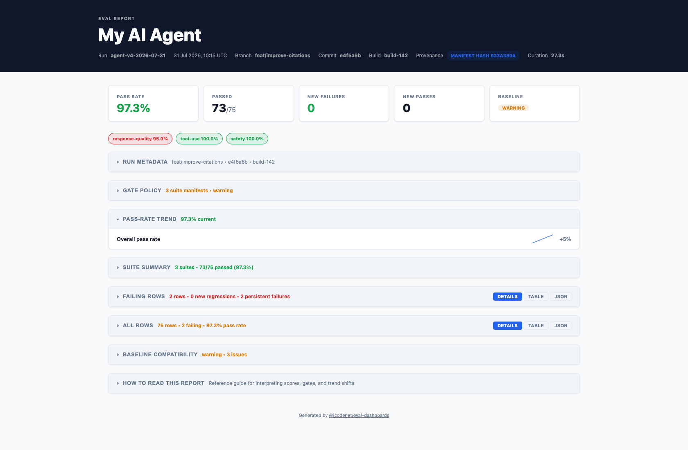
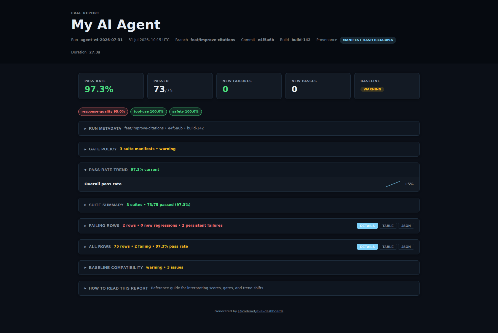

# @icodenet/eval-dashboards

[](https://www.npmjs.com/package/@icodenet/eval-dashboards)
[](LICENSE)
[](package.json)

**Standardized evaluation artifacts + beautiful dashboards for AI agent and LLM evals.**

Emit a taxonomy-complete `eval-report/v1` JSON artifact from any runner (Vitest, Jest, custom Node code, Python, etc.), then use `eval-dashboards` to generate reports, enforce quality gates, track history, and publish static dashboards. In this repo, `eval-report/v1` means version 1 of the shared JSON contract described in [docs/artifact-format.md](docs/artifact-format.md). No platform sign-up, no vendor lock-in.

> **Same mental model as [NYC/Istanbul](https://istanbul.js.org/) for code coverage** — but for LLM and agent evals. Schema-first, offline-first, runner-agnostic.

---

## Why eval-dashboards?

| Feature | @icodenet/eval-dashboards | Full-Featured Platform |
|---------|--------------------------|----------------------|
| **Standardized Schema** | ✅ JSON Schema + teaching docs | ⚠️ Vendor-specific |
| **Offline Reports** | ✅ Pure static HTML | ⚠️ Requires server |
| **Bring Your Own Runner** | ✅ Vitest, Jest, custom Node, Python, etc. | ❌ Must use platform's harness |
| **CI/CD Integration** | ✅ GitHub Actions, Azure Pipelines examples included | ⚠️ Usually provided |
| **Open Source** | ✅ MIT licensed | ❌ Proprietary |
| **Zero Lock-in** | ✅ Artifact is just JSON; export anytime | ❌ Your data is in their system |

**The core idea:** Your eval results are valuable even without dashboards. Standardize the artifact format first, then layer beautiful UI on top—not the other way around.

---

## Quick start

```sh
pnpm add -D @icodenet/eval-dashboards
```

```sh
# 1. Emit a taxonomy-complete artifact from your runner
my-eval-runner --output=.evals_output/run.json

# 2. Generate an HTML dashboard
eval-dashboards report --input=.evals_output --reporter=html

# 3. Enforce quality gates (non-zero exit if gates fail)
eval-dashboards check --input=.evals_output --min-pass-rate=0.9 --max-new-failures=0

# 4. Publish to GitHub Pages
eval-dashboards publish --target=github-pages --repo=owner/repo
```

See working examples:
- **Vitest**: [examples/vitest-evals/README.md](examples/vitest-evals/README.md)
- **Jest**: [examples/jest-custom-reporter/README.md](examples/jest-custom-reporter/README.md)
- **Plain Node/TypeScript**: [examples/node-plain-eval/README.md](examples/node-plain-eval/README.md)
- **Python / Pytest**: [examples/python-pytest-evals/README.md](examples/python-pytest-evals/README.md)
- **LangChain Evaluators**: [examples/langchain-evals/README.md](examples/langchain-evals/README.md)
- **Agent quality preset**: [examples/agent-quality-preset/README.md](examples/agent-quality-preset/README.md)

---

## Visual Gallery

The HTML dashboard is fully responsive and works in both light and dark themes. View live examples:

- **[Light theme dashboard](eval-report/index.html)** — Default presentation with light background
- **[Dark theme dashboard](eval-report-dark/index.html)** — Dark mode with reduced eye strain

| Light Theme | Dark Theme |
|---|---|
|  |  |

### Features Visible in Dashboard

**Metric Cards** (top)
- Pass rate with status coloring (orange for warning, red for fail, green for pass)
- Passed/total row count
- New failures and new passes since previous run
- Baseline compatibility status (compatible, warning, or blocked)

**Pass-Rate Trend** (historical view)
- Mini sparkline showing pass-rate over time
- Trend direction indicator: ↑ improving, ↓ regressing, → stable
- Percentage change calculation comparing current to baseline

**Suite Summary** (breakdown by test suite)
- Counts: total, passed, failed
- Pass-rate bar chart per suite
- Color-coded pass indicators

**Failing Rows** (grouped view)
- Rows organized hierarchically by dataset → scenario
- Collapsible sections for easy navigation
- Taxonomy completeness score (0–100%) with visual indicators
- Kind badges (deterministic, agent, llm-judge, human-review)
- Severity chips (low, medium, high, critical)

**All Rows** (complete inventory)
- Same hierarchical grouping as failing rows
- Includes both passing and failing results
- Full context for auditing and learning

---

## Schema & Taxonomy

### JSON Schema

The `eval-report/v1` format is documented as [JSON Schema Draft 7](schemas/eval-report-v1.schema.json). Use it to:
- **Validate** artifacts in CI
- **Generate** SDKs in any language
- **Discover** compatible tools

```bash
# Download the schema
curl https://raw.githubusercontent.com/icodenet/eval-dashboards/main/schemas/eval-report-v1.schema.json > my-runner/eval-report-v1.schema.json
```

### Taxonomy Teaching Guide

[docs/taxonomy.md](docs/taxonomy.md) defines what a "taxonomy-complete" eval report looks like and why it matters. It includes:

- **Row taxonomy:** Required fields (id, suite, passed), classification (kind, severity, category), evidence (input, output, turns, toolCalls, axisScores)
- **Suite taxonomy:** Manifests, gate policies, rubric contracts, versioning
- **Implementation checklist:** Copy-paste patterns for Vitest, Jest, plain Node
- **Real-world example:** Full artifact with multiple suites, judges, and tool calls
- **FAQ:** What fields are required? Optional? Can I add custom fields?

**Start here to understand what to emit.**

---

## Artifact Format Reference

Your runner emits `eval-report/v1` JSON:

```ts
{
  schemaVersion: 'eval-report/v1',
  run: { 
    id, generatedAt, project, team, branch, commit, buildId 
  },
  suites: [
    { id, name, total, passed, failed }
  ],
  rows: [{
    // Required
    id, suite, passed,
    
    // Classify (recommended)
    kind?,          // 'deterministic' | 'agent' | 'llm-judge' | 'human-review'
    severity?,      // 'none' | 'low' | 'medium' | 'high' | 'critical'
    category?,      // e.g., 'timeout', 'pii-leaked', 'off-topic'
    
    // Evidence (depends on kind)
    input?, output?, expected?,
    turns?,         // ConversationTurn[] for agents
    toolCalls?,     // ToolCall[] for agent actions
    judgeModel?, judgeVerdict?, judgeReasoning?,
    axisScores?,    // Record<string, number> for graded evaluations
    
    // Versioning & tracking
    datasetId?, scenarioId?, rubricId?,
    durationMs?,
  }],
  suiteManifests?: [{
    name, owner, riskArea, datasetVersion, rubricVersion,
    gate: { mode: 'blocking', thresholds: { passRate, zeroCritical } }
  }],
}
```

[Full format documentation](docs/artifact-format.md) | [JSON Schema](schemas/eval-report-v1.schema.json) | [Taxonomy guide](docs/taxonomy.md)

---

## CLI Commands

| Command | Description |
|---|---|
| `eval-dashboards report` | Generate HTML, text, Markdown, or JSON-summary dashboards from artifacts |
| `eval-dashboards report-index` | Generate grouped multi-report HTML index from discovered artifacts |
| `eval-dashboards lint` | Run fast semantic/taxonomy preflight checks before expensive eval runs |
| `eval-dashboards check` | Enforce pass-rate, new-failure, critical-severity, and suite-manifest gates |
| `eval-dashboards publish` | Publish dashboard to `dir`, `github-pages`, Azure Static Web Apps, or Azure Storage |
| `eval-dashboards history` | Build a history JSON trend file from discovered artifacts (pass-rate over time, etc.) |
| `eval-dashboards merge` | Merge multiple artifacts into one |
| `eval-dashboards init` | Print a starter `eval-dashboards.config.ts` |

---

## Configuration

```ts
// eval-dashboards.config.ts
export default {
  input:     ['.evals_output/**/*.json'],
  reportDir: 'eval-dashboard',
  reporters: ['html', 'json-summary'],
  theme:     'dark',
  locale:    'en-GB',
  gates: {
    minPassRate:    0.9,
    maxNewFailures: 0,
    zeroCritical:   true,
  },
};
```

See [docs/configuration.md](docs/configuration.md) for all options.

---

## Themes

Three built-in themes. Switch with `--theme` or set in config:

```sh
eval-dashboards report --theme=dark
eval-dashboards report --theme=minimal
eval-dashboards report --theme=default
```

Bring your own brand colors:

```ts
export default {
  theme: {
    name: 'default',
    variables: {
      '--banner-bg': '#1a1a2e',
      '--accent':    '#e94560',
      '--pass':      '#0f3460',
    },
  },
};
```

---

## Examples

**TypeScript / Node.js:**
- [Vitest evals example](examples/vitest-evals/README.md) — emit artifacts from test assertions
- [Jest reporter example](examples/jest-custom-reporter/README.md) — custom reporter emitting artifacts
- [Plain Node example](examples/node-plain-eval/README.md) — run eval logic and emit artifacts
- [Taxonomy-complete fixture](examples/taxonomy-complete-fixture/README.md) — template showing all recommended fields

**Python:**
- [Pytest evals example](examples/python-pytest-evals/README.md) — `conftest.py` plugin that collects rows and writes `eval-report/v1` artifacts after your pytest session
- [LangChain Evaluators](examples/langchain-evals/README.md) — wrap LangChain's built-in evaluators (QA, criteria, embedding) to emit taxonomy-complete rows

**CI/CD:**
- [GitHub Actions](examples/github-actions/eval-quality.yml)
- [Azure Pipelines](examples/azure-devops/azure-pipelines-eval.yml)

---

## Adoption & Community

This project is in **active development** (v0.x). Core schema and API are stabilizing. We're looking for:

**Release validity note:** because the branch history was rewritten to match the current codebase, only the latest release tied to this cleaned history should be treated as valid for the current code state. Earlier release artifacts are superseded and should not be used as references for the present implementation.

- **Eval runner authors** — integrate `eval-dashboards` as a native reporter option
- **Teams using custom evals** — adopt the schema and share feedback
- **Contributors** — improve HTML styling, add publishing targets, expand examples

**Current metrics (targeting by 2026-Q4):**
- ✅ Schema + taxonomy complete
- ⏳ 5+ external runners discovering this project
- ⏳ 1 runner emitting taxonomy-complete artifacts
- ⏳ 100+ npm downloads/week

**How to help:**
1. Try one of the [examples](examples/)
2. Emit an artifact from your runner and share feedback ([GitHub discussions](https://github.com/icodenet/eval-dashboards/discussions))
3. Report issues or suggest improvements
4. Star the repo if you find it useful!

---

## Documentation Index

- [Taxonomy teaching guide](docs/taxonomy.md) — what makes a "complete" eval report
- [Artifact format](docs/artifact-format.md) — field-by-field reference
- [JSON Schema](schemas/eval-report-v1.schema.json) — for validation and SDK generation
- [Configuration](docs/configuration.md) — all config options
- [Reporters](docs/reporters.md) — HTML, text, Markdown, JSON
- [Gates](docs/gates.md) — quality gates and CI integration
- [Publishing](docs/publishing.md) — GitHub Pages, Azure, custom
- [Roadmap](docs/ROADMAP.md) — phases and adoption plan
- [Comparison with NYC/Istanbul](docs/comparison-with-nyc.md)

See [examples/](examples/) for runnable demos.

---

## License

MIT © [Byron Thanopoulos](mailto:byronth@gmail.com)

- [Comparison with NYC/Istanbul](docs/comparison-with-nyc.md)